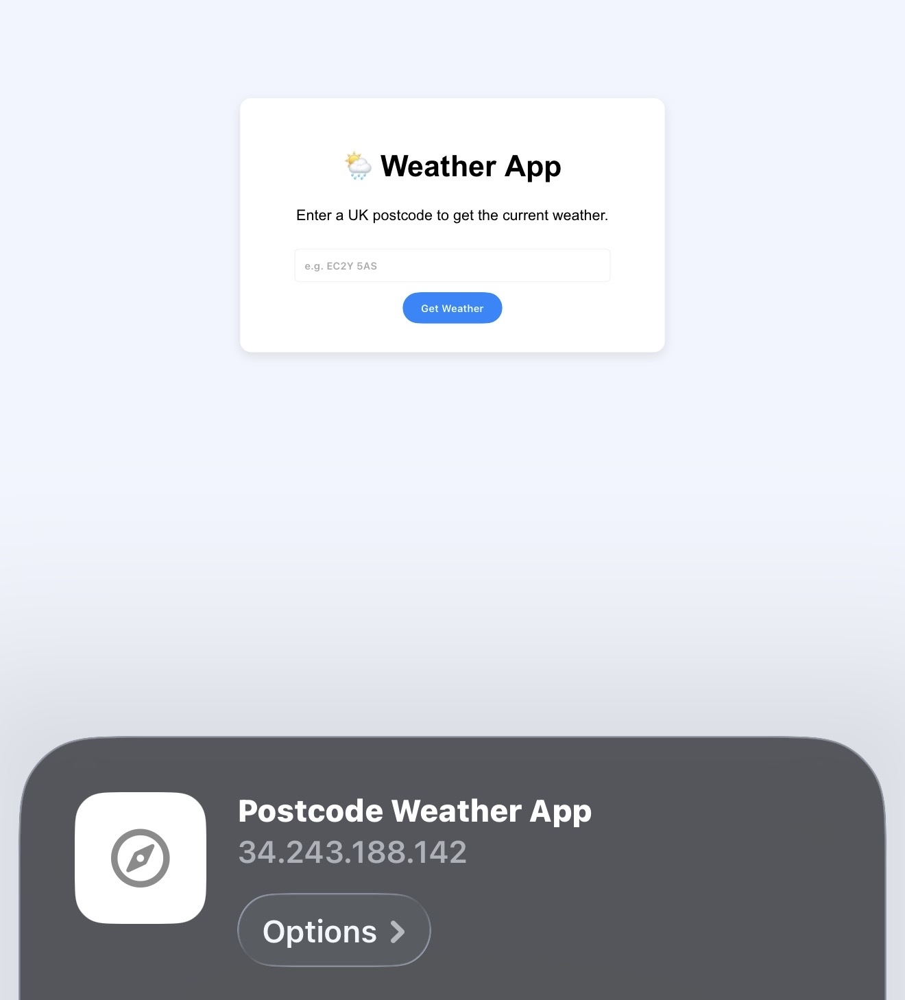

# Flask Weather Application Deployment Guide

## Overview

This guide demonstrates how to deploy a Flask Weather Application to an AWS EC2 instance running **Ubuntu 24.04**.

The application accepts a UK postcode, retrieves the corresponding latitude and longitude using the **Postcodes.io API**, then queries the **OpenWeather API** to display the current weather conditions.

The deployment uses **Gunicorn** as the application server and **Nginx** as a reverse proxy, allowing the Flask application to be accessed via HTTP on port 80.


---

## Technologies used

### Infrastructure
* AWS EC2 (t3.micro)
* Ubuntu 24.04

### Application
* Python 3
* Flask
* Gunicorn
* Nginx (Reverse Proxy)

### Python Dependencies
* pip
* Python Virtual Environment (`venv`)
* Requests
---

# Architecture

```text
HTTP Request
______________________________________________________________

User (Browser)
      │
      ▼ 
Nginx (Port 80)
      │
      ▼
Gunicorn (Port 5000)
      │
      ▼
Flask Weather App
      │
      ├──► Postcodes.io API (Get Latitude & Longitude)
      │
      └──► OpenWeather API (Get Weather Data)
```

---

# Prerequisites

Before beginning the deployment, ensure you have:

* AWS EC2 t3.micro instance
* Ubuntu 24.04
* SSH key pair
* Security Group configured

  * Port 22 (SSH) – Your IP Address
  * Port 80 (HTTP) – Anywhere (0.0.0.0/0)
* Flask application (`app.py`)

---

# Step 1 – Connect to the EC2 Instance

```bash
ssh -i ~/.ssh/maria-tech610-key.pem ubuntu@34.243.188.142
```

### Why?

This securely connects to the Ubuntu virtual machine using SSH.


---

# Step 2 – Update Ubuntu

```bash
sudo apt update -y
sudo apt upgrade -y
```

### Why?

It updates the package list and installs the latest security updates before installing any software, to ensure the softare can run.

---

# Step 3 – Install Required Software

## Install Python

```bash
sudo apt install python3 -y
```

**Purpose**

Installs Python 3, which is required to run the Flask application.

---

## Install pip

```bash
sudo apt install python3-pip -y
```

**Purpose**

Installs Python's package manager, which is used to install Flask, Requests and Gunicorn.

---

## Install Python Virtual Environment

```bash
sudo apt install python3.12-venv -y
```

**Purpose**

Installs the tools required to create a Python virtual environment.

---

## Install Git

```bash
sudo apt install git -y
```

**Purpose**

Allows repositories to be cloned and updated from GitHub.

---

## Install Nginx

```bash
sudo apt install nginx -y
```

**Purpose**

Acts as a reverse proxy between the user and the Flask application.

---

# Step 4 – Copy the Flask Application

Copy the application to the EC2 instance.

```bash
scp -i ~/.ssh/maria-tech610-key.pem app.py ubuntu@34.243.188.142:/home/ubuntu/
```

### Why?

This transfers the Flask application securely from the local machine to the EC2 instance.


---

# Step 5 – Create a Virtual Environment

```bash
python3 -m venv venv
```

Activate the virtual environment:

```bash
source venv/bin/activate
```

### Why?

This is needed because a virtual environment isolates the application's Python packages from the operating system.

---

# Step 6 – Install Python Packages

```bash
pip install flask requests gunicorn
```

| Package  | Purpose                |
| -------- | ---------------------- |
| Flask    | Web framework          |
| Requests | Makes API requests     |
| Gunicorn | Production WSGI server |

---

# Step 7 – Start the Application

```bash
gunicorn --bind 127.0.0.1:5000 app:app --daemon
```

### Why?
This starts the Flask application using Gunicorn and runs it in the background.

------

# Step 7 (b) Check that it is actaully running
```bash
ps aux | grep gunicorn
```  
**Expected output:**

```bash
.... /home/ubuntu/venv/bin/gunicorn
```


---

# Step 8 – Configure Nginx

Open the default configuration:

```bash
sudo nano /etc/nginx/sites-available/default
```

Replace the existing location:

```nginx
location / {
    try_files $uri $uri/ =404;
}
```

with:

```nginx
location / {
    proxy_pass http://127.0.0.1:5000;
    proxy_set_header Host $host;
    proxy_set_header X-Real-IP $remote_addr;
}
```

### Why?

Instead of serving static files, Nginx forwards incoming HTTP requests to Gunicorn, which serves the Flask application.


### Then save and exit nano
```
CTRL + O
ENTER
CTRL + X
```
---

# Step 9 – Test the Configuration

```bash
sudo nginx -t
```

**Expected output:**

```text
nginx: the configuration file /etc/nginx/nginx.conf syntax is ok
nginx: configuration file /etc/nginx/nginx.conf test is successful
```

### Why?

This checks for syntax errors before restarting Nginx.

---

# Step 10 – Restart Nginx

```bash
sudo systemctl restart nginx
```

Verify the service:

```bash
systemctl status nginx
```

Expected output:

```text
active (running)
```

### Why?

Restarts Nginx so the new reverse proxy configuration is applied.

---

# Step 11 – Test the Application

Visit:

```text
http://34.243.188.142
```

Example endpoint:

```text
http://34.243.188.142 /weather?postcode=EC2Y5AS
```

The application should return the current weather information for the supplied postcode.

> **Frontend Demonstration:** Flask Weather Application running successfully with the corresponding ip address




> A close up:


---

# Deployment Script

A deployment script (`deploy_weather.sh`) is included to automate the deployment process.

Make the script executable:

```bash
chmod +x deploy_weather.sh
```

Run the script:

```bash
./deploy_weather.sh
```

---

# Troubleshooting

## Virtual Environment Error

If you receive:

```text
ensurepip is not available
```

Install the required package:

```bash
sudo apt install python3.12-venv -y
```

---

## Nginx Configuration Error

Test the configuration:

```bash
sudo nginx -t
```

Correct any syntax errors before restarting Nginx.

---

# Reflection

Through this deployment I learned how to:

* Deploy a Flask application to AWS EC2.
* Configure an Ubuntu 24.04 server.
* Install Linux dependencies using `apt`.
* Create and use Python virtual environments.
* Install Python packages using `pip`.
* Deploy a Flask application with Gunicorn.
* Configure Nginx as a reverse proxy.
* Connect a Flask application to external APIs.
* Troubleshoot deployment and configuration issues.
* Automate deployment using a Bash script.

